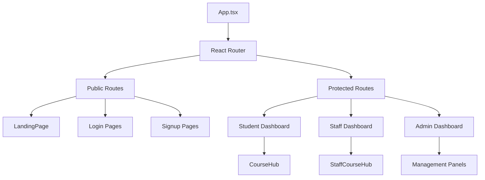
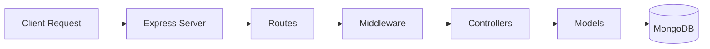

# 🎓 Student Course Management System

A full-stack web application for managing students, courses, and enrollments with role-based access control for Students, Staff, and Admins.

---

## 📋 Table of Contents

- [Tech Stack](#-tech-stack)
- [Project Structure](#-project-structure)
- [Getting Started](#-getting-started)
- [Frontend Workflow](#-frontend-workflow)
- [Backend Workflow](#-backend-workflow)
- [API Endpoints](#-api-endpoints)
- [Features](#-features)
- [Environment Variables](#-environment-variables)

---

## 🛠 Tech Stack

### Frontend
| Technology | Purpose |
|------------|---------|
| **React 19** | UI Library |
| **TypeScript** | Type Safety |
| **Vite** | Build Tool & Dev Server |
| **React Router DOM** | Client-side Routing |
| **React Query** | Server State Management |
| **React Hook Form** | Form Handling |
| **Tailwind CSS 4** | Styling |
| **Bootstrap Icons** | Icon Library |

### Backend
| Technology | Purpose |
|------------|---------|
| **Node.js** | Runtime Environment |
| **Express.js** | Web Framework |
| **TypeScript** | Type Safety |
| **MongoDB** | Database |
| **Mongoose** | ODM for MongoDB |
| **JWT** | Authentication |
| **bcryptjs** | Password Hashing |
| **Nodemailer** | Email Service |

---

## 📁 Project Structure

```
Student-Course-Management-System/
├── frontend/                    # React Frontend Application
│   ├── src/
│   │   ├── components/          # Reusable UI Components
│   │   ├── hooks/               # Custom React Hooks
│   │   ├── pages/               # Page Components
│   │   │   ├── AdminDashboard/  # Admin Panel Pages
│   │   │   ├── StaffDashboard/  # Staff Panel Pages
│   │   │   ├── Dashboard/       # Student Dashboard Pages
│   │   │   ├── CourseHub/       # Student Course Hub
│   │   │   └── StaffCourseHub/  # Staff Course Hub
│   │   ├── styles/              # Global Styles
│   │   ├── types/               # TypeScript Types
│   │   ├── utils/               # Utility Functions
│   │   └── App.tsx              # Main App Component
│   ├── package.json
│   └── vite.config.ts
│
├── backend/                     # Express Backend API
│   ├── src/
│   │   ├── config/              # Database Configuration
│   │   ├── controllers/         # Request Handlers
│   │   ├── middleware/          # Auth & Validation Middleware
│   │   ├── models/              # MongoDB Models
│   │   ├── routes/              # API Routes
│   │   ├── types/               # TypeScript Types
│   │   ├── utils/               # Utility Functions & Email
│   │   └── server.ts            # Entry Point
│   ├── uploads/                 # Uploaded Files
│   ├── .env                     # Environment Variables
│   └── package.json
│
└── README.md
```

---

## 🚀 Getting Started

### Prerequisites
- **Node.js** (v18 or higher)
- **npm** or **yarn**
- **MongoDB** (local or cloud instance)

### Installation

#### 1. Clone the Repository
```bash
git clone https://github.com/Poovarasan0914/Student-Course-Management-System.git
cd Student-Course-Management-System
```

#### 2. Setup Backend
```bash
cd backend
npm install
```

Create a `.env` file in the backend directory:
```env
PORT=5000
MONGODB_URI=mongodb://localhost:27017/student_course_db
JWT_SECRET=your_jwt_secret_key
JWT_EXPIRES_IN=7d
EMAIL_USER=your_email@gmail.com
EMAIL_PASS=your_email_password
```

#### 3. Setup Frontend
```bash
cd ../frontend
npm install
```

#### 4. Run the Application

Open two terminals:

**Terminal 1 - Backend:**
```bash
cd backend
npm run dev
```

**Terminal 2 - Frontend:**
```bash
cd frontend
npm run dev
```

The frontend will be available at `http://localhost:5173` and the backend API at `http://localhost:5000`.

---

## 🎨 Frontend Workflow

### Development Commands

| Command | Description |
|---------|-------------|
| `npm run dev` | Start development server with HMR |
| `npm run build` | Build for production |
| `npm run preview` | Preview production build |
| `npm run lint` | Run ESLint |
| `npm run db` | Start JSON server (mock API) |

### Application Architecture



### Key Features

| Feature | Description |
|---------|-------------|
| **Role-Based Routing** | Protected routes based on user roles (student/staff/admin) |
| **React Query** | Efficient data fetching with caching and background updates |
| **React Hook Form** | Form validation and submission handling |
| **Custom Hooks** | Reusable hooks for auth, courses, enrollments |

### Page Routes

| Route | Component | Access |
|-------|-----------|--------|
| `/` | LandingPage | Public |
| `/login` | Login | Public |
| `/signup` | Signup | Public |
| `/dashboard` | Dashboard | Student |
| `/course-hub` | CourseHub | Student |
| `/staff/login` | StaffLogin | Public |
| `/staff/signup` | StaffSignup | Public |
| `/staff/dashboard` | StaffDashboard | Staff |
| `/staff/course-hub` | StaffCourseHub | Staff |
| `/admin/login` | AdminLogin | Public |
| `/admin/dashboard` | AdminDashboard | Admin |

---

## ⚙️ Backend Workflow

### Development Commands

| Command | Description |
|---------|-------------|
| `npm run dev` | Start dev server with hot reload |
| `npm run build` | Compile TypeScript to JavaScript |
| `npm start` | Run production build |
| `npm run seed` | Seed the database with initial data |

### Server Architecture



### Middleware Pipeline

| Middleware | Purpose |
|------------|---------|
| **CORS** | Cross-Origin Resource Sharing |
| **authMiddleware** | JWT Token Verification |
| **roleMiddleware** | Role-Based Access Control |
| **validators** | Request Validation |
| **errorHandler** | Global Error Handling |

### Database Models

| Model | Description |
|-------|-------------|
| **Admin** | Admin users with full system access |
| **Staff** | Instructors who create and manage courses |
| **Student** | Students who enroll in courses |
| **Course** | Course details and materials |
| **Enrollment** | Student-Course relationships |
| **Message** | Course chat messages |
| **Material** | Course materials and attachments |

---

## 📡 API Endpoints

### Authentication
| Method | Endpoint | Description |
|--------|----------|-------------|
| POST | `/api/auth/signup` | Student registration |
| POST | `/api/auth/login` | Student login |
| POST | `/api/auth/admin/login` | Admin login |
| POST | `/api/auth/staff/signup` | Staff registration |
| POST | `/api/auth/staff/login` | Staff login |

### Courses
| Method | Endpoint | Description |
|--------|----------|-------------|
| GET | `/api/courses` | Get all approved courses |
| GET | `/api/courses/:id` | Get course by ID |
| POST | `/api/courses` | Create course (Staff) |
| PUT | `/api/courses/:id` | Update course |
| DELETE | `/api/courses/:id` | Delete course |
| PUT | `/api/courses/:id/approve` | Approve course (Admin) |

### Enrollments
| Method | Endpoint | Description |
|--------|----------|-------------|
| POST | `/api/enrollments` | Enroll in course (Student) |
| GET | `/api/enrollments/my-enrollments` | Get my enrollments |
| PUT | `/api/enrollments/:id/cancel` | Cancel enrollment |

### Messages & Materials
| Method | Endpoint | Description |
|--------|----------|-------------|
| GET | `/api/messages/course/:courseId` | Get course messages |
| POST | `/api/messages` | Send message |
| GET | `/api/materials/course/:courseId` | Get course materials |
| POST | `/api/materials` | Upload material |

---

## ✨ Features

### For Students
- ✅ Registration and Login
- ✅ Browse available courses
- ✅ Enroll in courses
- ✅ View enrolled courses
- ✅ Access course materials
- ✅ Participate in course chat

### For Staff/Instructors
- ✅ Registration with admin approval
- ✅ Create and manage courses
- ✅ Upload course materials
- ✅ Communicate with students
- ✅ View enrolled students

### For Administrators
- ✅ Manage all users (Students, Staff, Admins)
- ✅ Approve/Reject Staff registrations
- ✅ Approve/Reject Course submissions
- ✅ View system statistics
- ✅ Full CRUD operations on all entities

---

## 🔐 Environment Variables

### Backend (.env)

| Variable | Description | Example |
|----------|-------------|---------|
| `PORT` | Server port | `5000` |
| `MONGODB_URI` | MongoDB connection string | `mongodb://localhost:27017/db` |
| `JWT_SECRET` | Secret key for JWT tokens | `your_secret_key` |
| `JWT_EXPIRES_IN` | JWT token expiration | `7d` |
| `EMAIL_USER` | Email service username | `email@gmail.com` |
| `EMAIL_PASS` | Email service password | `app_password` |

---

## 📝 License

This project is licensed under the ISC License.

---

## 👥 Contributors

- **Poovarasan** - Full Stack Developer

---

<p align="center">Made with ❤️ using React, Express & MongoDB</p>
