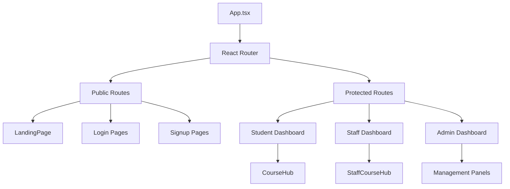
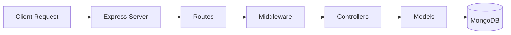

# 🎓 Student Course Management System

A comprehensive full-stack web application for managing students, courses, and enrollments with role-based access control. The system supports three distinct user roles: **Students**, **Staff (Instructors)**, and **Administrators**, each with tailored functionalities and permissions.

## 🎯 Project Overview

This system provides a complete learning management solution where:
- **Students** can browse, enroll in courses, access materials, and participate in course discussions
- **Staff/Instructors** can create courses, upload materials, communicate with students, and manage their courses
- **Administrators** have full system control including user management, course approval, and system oversight

---

## 📋 Table of Contents

- [Tech Stack](#-tech-stack)
- [Project Structure](#-project-structure)
- [Getting Started](#-getting-started)
- [Database Schema](#-database-schema)
- [Authentication & Authorization](#-authentication--authorization)
- [Frontend Workflow](#-frontend-workflow)
- [Backend Workflow](#-backend-workflow)
- [API Endpoints](#-api-endpoints)
- [Features](#-features)
- [Email Functionality](#-email-functionality)
- [File Upload System](#-file-upload-system)
- [Environment Variables](#-environment-variables)
- [Testing](#-testing)
- [Deployment](#-deployment)
- [Troubleshooting](#-troubleshooting)

---

## 🛠 Tech Stack

### Frontend
| Technology | Purpose |
|------------|---------|
| **React 19** | UI Library |
| **TypeScript** | Type Safety |
| **Vite** | Build Tool & Dev Server |
| **React Router DOM** | Client-side Routing |
| **React Query** | Server State Management |
| **React Hook Form** | Form Handling |
| **Tailwind CSS 4** | Styling |
| **Bootstrap Icons** | Icon Library |

### Backend
| Technology | Purpose |
|------------|---------|
| **Node.js** | Runtime Environment |
| **Express.js** | Web Framework |
| **TypeScript** | Type Safety |
| **MongoDB** | Database |
| **Mongoose** | ODM for MongoDB |
| **JWT** | Authentication |
| **bcryptjs** | Password Hashing |
| **Nodemailer** | Email Service |

---

## 📁 Project Structure

```
Student-Course-Management-System/
├── frontend/                          # React Frontend Application
│   ├── src/
│   │   ├── components/                # Reusable UI Components
│   │   │   ├── ui/                    # Base UI components (Button, FormInput, etc.)
│   │   │   ├── AuthLayout.tsx         # Authentication layout wrapper
│   │   │   ├── CourseCard.tsx         # Course display card
│   │   │   └── ProtectedRoute.tsx     # Route protection component
│   │   ├── hooks/                     # Custom React Hooks
│   │   │   └── api/                   # API hooks (useAuth, useCourses, etc.)
│   │   ├── pages/                     # Page Components
│   │   │   ├── AdminDashboard/        # Admin Panel Pages
│   │   │   │   ├── components/        # Admin-specific components
│   │   │   │   ├── hooks/             # Admin dashboard hooks
│   │   │   │   └── utils/             # Helper functions
│   │   │   ├── StaffDashboard/        # Staff Panel Pages
│   │   │   ├── Dashboard/             # Student Dashboard Pages
│   │   │   ├── CourseHub/            # Student Course Hub (materials & chat)
│   │   │   ├── StaffCourseHub/       # Staff Course Hub
│   │   │   ├── LandingPage.tsx       # Public landing page
│   │   │   ├── Login.tsx             # Student login
│   │   │   ├── Signup.tsx            # Student signup
│   │   │   ├── StaffLogin.tsx        # Staff login
│   │   │   ├── StaffSignup.tsx       # Staff signup
│   │   │   ├── AdminLogin.tsx        # Admin login
│   │   │   └── ForgotPassword.tsx    # Password reset
│   │   ├── styles/                    # Global Styles
│   │   ├── types/                     # TypeScript Type Definitions
│   │   ├── utils/                     # Utility Functions
│   │   ├── assets/                    # Static assets (images)
│   │   ├── App.tsx                    # Main App Component & Routes
│   │   └── main.tsx                   # Application Entry Point
│   ├── public/                        # Public assets
│   ├── package.json
│   ├── vite.config.ts                 # Vite configuration
│   └── tsconfig.json                  # TypeScript configuration
│
├── backend/                            # Express Backend API
│   ├── src/
│   │   ├── config/                     # Configuration files
│   │   │   ├── db.ts                  # MongoDB connection
│   │   │   └── email.ts               # Email service configuration
│   │   ├── controllers/                # Request Handlers (Business Logic)
│   │   │   ├── adminController.ts     # Admin operations
│   │   │   ├── authController.ts      # Authentication logic
│   │   │   ├── courseController.ts    # Course CRUD operations
│   │   │   ├── enrollmentController.ts # Enrollment management
│   │   │   ├── materialController.ts   # Material upload/download
│   │   │   ├── messageController.ts   # Chat/messaging
│   │   │   ├── staffController.ts     # Staff management
│   │   │   └── studentController.ts   # Student management
│   │   ├── middleware/                # Express Middleware
│   │   │   ├── authMiddleware.ts      # JWT authentication & role-based access
│   │   │   ├── errorHandler.ts        # Global error handling
│   │   │   └── validators.ts          # Request validation
│   │   ├── models/                    # MongoDB Models (Mongoose Schemas)
│   │   │   ├── Admin.ts               # Admin user model
│   │   │   ├── Staff.ts               # Staff/instructor model
│   │   │   ├── Student.ts             # Student model
│   │   │   ├── Course.ts              # Course model
│   │   │   ├── Enrollment.ts          # Enrollment model
│   │   │   ├── Material.ts            # Course material model
│   │   │   └── Message.ts             # Chat message model
│   │   ├── routes/                    # API Routes
│   │   │   ├── adminRoutes.ts         # Admin endpoints
│   │   │   ├── authRoutes.ts          # Authentication endpoints
│   │   │   ├── courseRoutes.ts        # Course endpoints
│   │   │   ├── enrollmentRoutes.ts    # Enrollment endpoints
│   │   │   ├── materialRoutes.ts      # Material endpoints
│   │   │   ├── messageRoutes.ts       # Message endpoints
│   │   │   ├── staffRoutes.ts         # Staff endpoints
│   │   │   └── studentRoutes.ts       # Student endpoints
│   │   ├── types/                     # TypeScript Type Definitions
│   │   ├── utils/                     # Utility Functions
│   │   │   └── email/                 # Email service & templates
│   │   │       ├── sendEmail.ts       # Email sending logic
│   │   │       └── templates/         # Email templates
│   │   ├── seed.ts                    # Database seeding script
│   │   └── server.ts                  # Express Server Entry Point
│   ├── uploads/                       # Uploaded Files Storage
│   │   └── materials/                 # Course materials storage
│   ├── .env                           # Environment Variables (not in repo)
│   ├── package.json
│   └── tsconfig.json                  # TypeScript configuration
│
└── README.md                           # Project Documentation
```

---

## 🚀 Getting Started

### Prerequisites
- **Node.js** (v18 or higher)
- **npm** or **yarn**
- **MongoDB** (local or cloud instance)

### Installation

#### 1. Clone the Repository
```bash
git clone https://github.com/Poovarasan0914/Student-Course-Management-System.git
cd Student-Course-Management-System
```

#### 2. Setup Backend
```bash
cd backend
npm install
```

Create a `.env` file in the backend directory:
```env
PORT=5000
MONGODB_URI=mongodb://localhost:27017/student_course_db
JWT_SECRET=your_jwt_secret_key
JWT_EXPIRES_IN=7d
EMAIL_USER=your_email@gmail.com
EMAIL_PASS=your_email_password
```

#### 3. Setup Frontend
```bash
cd ../frontend
npm install
```

#### 4. Run the Application

Open two terminals:

**Terminal 1 - Backend:**
```bash
cd backend
npm run dev
```

**Terminal 2 - Frontend:**
```bash
cd frontend
npm run dev
```

The frontend will be available at `http://localhost:5173` and the backend API at `http://localhost:5000`.

#### 5. Seed Database (Optional)

To create a default admin account, run:
```bash
cd backend
npm run seed
```

**Default Admin Credentials:**
- Email: `admin@admin.com`
- Password: `admin123`

> ⚠️ **Important:** Change the default admin password after first login in production!

---

## 🗄️ Database Schema

### Models Overview

#### **Admin Model**
```typescript
{
  firstName: string
  lastName: string
  email: string (unique)
  password: string (hashed)
  role: 'admin' | 'superadmin'
  resetPasswordToken?: string
  resetPasswordExpiry?: Date
  createdAt: Date
  updatedAt: Date
}
```

#### **Staff Model**
```typescript
{
  firstName: string
  lastName: string
  email: string (unique)
  password: string (hashed)
  specialization: string
  resetPasswordToken?: string
  resetPasswordExpiry?: Date
  createdAt: Date
  updatedAt: Date
}
```

#### **Student Model**
```typescript
{
  firstName: string
  lastName: string
  email: string (unique)
  password: string (hashed)
  acceptTerms: boolean
  resetPasswordToken?: string
  resetPasswordExpiry?: Date
  createdAt: Date
  updatedAt: Date
}
```

#### **Course Model**
```typescript
{
  title: string
  description: string
  instructor: string
  instructorId: ObjectId (ref: Staff)
  duration: string
  price: string
  image: string
  videoUrl: string
  students: number (default: 0)
  rating: number (0-5, default: 0)
  createdAt: Date
  updatedAt: Date
}
```

#### **Enrollment Model**
```typescript
{
  courseId: ObjectId (ref: Course)
  courseTitle: string
  courseInstructor: string
  coursePrice: string
  courseDuration: string
  studentId: ObjectId (ref: Student)
  studentName: string
  studentEmail: string
  enrolledAt: Date
  status: 'active' | 'completed' | 'cancelled'
  createdAt: Date
  updatedAt: Date
}
```

#### **Material Model**
```typescript
{
  courseId: ObjectId (ref: Course)
  uploadedBy: ObjectId (ref: Staff)
  uploadedByName: string
  title: string
  description: string
  category: 'Lecture Notes' | 'Assignment' | 'Study Material' | 'Exam Preparation'
  fileName: string
  fileType: string
  fileSize: number
  filePath: string
  fileUrl: string
  createdAt: Date
  updatedAt: Date
}
```

#### **Message Model**
```typescript
{
  courseId: ObjectId (ref: Course)
  senderId: ObjectId
  senderName: string
  senderRole: 'staff' | 'student'
  content: string
  messageType: 'text' | 'link'
  createdAt: Date
  updatedAt: Date
}
```

---

## 🔐 Authentication & Authorization

### Authentication Flow

1. **User Registration/Login**
   - User submits credentials
   - Backend validates and hashes password (bcrypt)
   - JWT token generated with user ID and role
   - Token stored in localStorage (frontend)

2. **Token Verification**
   - Protected routes require `Authorization: Bearer <token>` header
   - Middleware verifies token and extracts user info
   - User object attached to request for use in controllers

3. **Role-Based Access Control**
   - Middleware checks user role against required role
   - Roles: `student`, `staff`, `admin`, `superadmin`
   - Access denied if role doesn't match

### Authorization Levels

| Route Type | Student | Staff | Admin |
|------------|---------|-------|-------|
| View Courses | ✅ | ✅ | ✅ |
| Enroll in Course | ✅ | ❌ | ❌ |
| Create Course | ❌ | ✅* | ✅ |
| Approve Course | ❌ | ❌ | ✅ |
| Upload Materials | ❌ | ✅ | ✅ |
| Manage Users | ❌ | ❌ | ✅ |
| View All Enrollments | ❌ | ✅** | ✅ |

\* Requires admin approval  
\** Only for own courses

---

## 🎨 Frontend Workflow

### Development Commands

| Command | Description |
|---------|-------------|
| `npm run dev` | Start development server with HMR |
| `npm run build` | Build for production |
| `npm run preview` | Preview production build |
| `npm run lint` | Run ESLint |
| `npm run db` | Start JSON server (mock API) |

### Application Architecture



### Key Features

| Feature | Description |
|---------|-------------|
| **Role-Based Routing** | Protected routes based on user roles (student/staff/admin) |
| **React Query** | Efficient data fetching with caching and background updates |
| **React Hook Form** | Form validation and submission handling |
| **Custom Hooks** | Reusable hooks for auth, courses, enrollments |

### Page Routes

| Route | Component | Access |
|-------|-----------|--------|
| `/` | LandingPage | Public |
| `/login` | Login | Public |
| `/signup` | Signup | Public |
| `/dashboard` | Dashboard | Student |
| `/course-hub` | CourseHub | Student |
| `/staff/login` | StaffLogin | Public |
| `/staff/signup` | StaffSignup | Public |
| `/staff/dashboard` | StaffDashboard | Staff |
| `/staff/course-hub` | StaffCourseHub | Staff |
| `/admin/login` | AdminLogin | Public |
| `/admin/dashboard` | AdminDashboard | Admin |

---

## ⚙️ Backend Workflow

### Development Commands

| Command | Description |
|---------|-------------|
| `npm run dev` | Start dev server with hot reload |
| `npm run build` | Compile TypeScript to JavaScript |
| `npm start` | Run production build |
| `npm run seed` | Seed the database with initial data |

### Server Architecture



### Middleware Pipeline

| Middleware | Purpose |
|------------|---------|
| **CORS** | Cross-Origin Resource Sharing |
| **authMiddleware** | JWT Token Verification |
| **roleMiddleware** | Role-Based Access Control |
| **validators** | Request Validation |
| **errorHandler** | Global Error Handling |

### Database Models

| Model | Description |
|-------|-------------|
| **Admin** | Admin users with full system access |
| **Staff** | Instructors who create and manage courses |
| **Student** | Students who enroll in courses |
| **Course** | Course details and materials |
| **Enrollment** | Student-Course relationships |
| **Message** | Course chat messages |
| **Material** | Course materials and attachments |

---

## 📡 API Endpoints

### Authentication
| Method | Endpoint | Description |
|--------|----------|-------------|
| POST | `/api/auth/signup` | Student registration |
| POST | `/api/auth/login` | Student login |
| POST | `/api/auth/admin/login` | Admin login |
| POST | `/api/auth/staff/signup` | Staff registration |
| POST | `/api/auth/staff/login` | Staff login |

### Courses
| Method | Endpoint | Description |
|--------|----------|-------------|
| GET | `/api/courses` | Get all approved courses |
| GET | `/api/courses/:id` | Get course by ID |
| POST | `/api/courses` | Create course (Staff) |
| PUT | `/api/courses/:id` | Update course |
| DELETE | `/api/courses/:id` | Delete course |
| PUT | `/api/courses/:id/approve` | Approve course (Admin) |

### Enrollments
| Method | Endpoint | Description |
|--------|----------|-------------|
| POST | `/api/enrollments` | Enroll in course (Student) |
| GET | `/api/enrollments/my-enrollments` | Get my enrollments |
| PUT | `/api/enrollments/:id/cancel` | Cancel enrollment |

### Messages & Materials
| Method | Endpoint | Description | Auth |
|--------|----------|-------------|------|
| GET | `/api/messages/course/:courseId` | Get course messages | Protected |
| POST | `/api/messages` | Send message | Protected |
| GET | `/api/materials/course/:courseId` | Get course materials | Protected |
| POST | `/api/materials` | Upload material | Staff/Admin |
| GET | `/api/materials/:id` | Download material | Protected |
| DELETE | `/api/materials/:id` | Delete material | Staff/Admin |

### Admin Endpoints
| Method | Endpoint | Description | Auth |
|--------|----------|-------------|------|
| GET | `/api/admins` | Get all admins | Admin |
| GET | `/api/admins/profile` | Get admin profile | Admin |
| POST | `/api/admins` | Create admin | Admin |
| PUT | `/api/admins/:id` | Update admin | Admin |
| DELETE | `/api/admins/:id` | Delete admin | Admin |
| GET | `/api/staff/pending` | Get pending staff | Admin |
| PUT | `/api/staff/:id/approve` | Approve staff | Admin |
| PUT | `/api/staff/:id/reject` | Reject staff | Admin |
| GET | `/api/courses/admin/all` | Get all courses | Admin |
| GET | `/api/courses/admin/pending` | Get pending courses | Admin |
| PUT | `/api/courses/:id/approve` | Approve course | Admin |
| PUT | `/api/courses/:id/reject` | Reject course | Admin |
| GET | `/api/enrollments` | Get all enrollments | Admin |
| GET | `/api/enrollments/course/:courseId` | Get enrollments by course | Admin |

### Staff Endpoints
| Method | Endpoint | Description | Auth |
|--------|----------|-------------|------|
| GET | `/api/staff/profile` | Get staff profile | Staff |
| GET | `/api/courses/instructor/my-courses` | Get instructor's courses | Staff |
| GET | `/api/enrollments/course/:courseId` | Get enrollments for course | Staff |

### Student Endpoints
| Method | Endpoint | Description | Auth |
|--------|----------|-------------|------|
| GET | `/api/students/profile` | Get student profile | Student |
| PUT | `/api/students/profile` | Update student profile | Student |

---

## ✨ Features

### For Students 👨‍🎓
- ✅ **Account Management**
  - Registration with email validation
  - Secure login with JWT authentication
  - Password reset functionality
  - Profile management

- ✅ **Course Discovery**
  - Browse all approved courses
  - View course details (description, instructor, duration, price)
  - Search and filter courses
  - View course ratings and student count

- ✅ **Enrollment Management**
  - Enroll in courses with one click
  - View all enrolled courses in dashboard
  - Cancel enrollments
  - Track enrollment status (active/completed/cancelled)
  - Automatic enrollment confirmation emails

- ✅ **Learning Resources**
  - Access course materials (PDFs, documents, etc.)
  - Download course materials
  - View material categories (Lecture Notes, Assignments, etc.)
  - File preview functionality

- ✅ **Communication**
  - Participate in course-specific chat
  - Send messages to instructors
  - Receive messages from staff
  - Real-time messaging interface

### For Staff/Instructors 👨‍🏫
- ✅ **Account Management**
  - Registration (requires admin approval)
  - Secure login
  - Profile management with specialization
  - Password reset

- ✅ **Course Management**
  - Create new courses with rich details
  - Edit own courses
  - Upload course images and video URLs
  - View all created courses
  - Track student enrollment count
  - Courses require admin approval before going live

- ✅ **Material Management**
  - Upload course materials (PDFs, documents, etc.)
  - Categorize materials (Lecture Notes, Assignments, Study Material, Exam Preparation)
  - Add descriptions to materials
  - Delete materials
  - Track upload history

- ✅ **Student Interaction**
  - View enrolled students for each course
  - Communicate with students via course chat
  - Respond to student queries
  - Monitor course engagement

- ✅ **Analytics**
  - View enrollment statistics per course
  - Track course popularity

### For Administrators 👨‍💼
- ✅ **User Management**
  - View all users (Students, Staff, Admins)
  - Create new admin accounts
  - Update user information
  - Delete users
  - View user profiles

- ✅ **Staff Approval System**
  - Review pending staff registrations
  - Approve or reject staff applications
  - View staff specialization and details

- ✅ **Course Approval System**
  - Review all course submissions
  - Approve courses to make them public
  - Reject courses with feedback
  - Edit course details
  - Delete courses

- ✅ **Enrollment Management**
  - View all enrollments across the system
  - Filter enrollments by course
  - View enrollment statistics
  - Monitor student activity

- ✅ **System Overview**
  - Dashboard with key metrics
  - Total users count
  - Total courses count
  - Total enrollments count
  - System-wide statistics

- ✅ **Full System Control**
  - Complete CRUD operations on all entities
  - System configuration
  - Data management

---

## 📧 Email Functionality

The system includes automated email notifications powered by Nodemailer:

### Email Types

1. **Welcome Email** (`welcomeEmailTemplate.ts`)
   - Sent to new students upon registration
   - Includes welcome message and account details

2. **Enrollment Confirmation Email** (`enrollmentEmailTemplate.ts`)
   - Sent to students when they enroll in a course
   - Includes course details and enrollment confirmation

3. **Password Reset Email** (`passwordResetEmailTemplate.ts`)
   - Sent when user requests password reset
   - Includes reset token and instructions

### Email Configuration

Configure email settings in `backend/src/config/email.ts`:
- SMTP server settings
- Email templates
- Email sending logic

---

## 📁 File Upload System

### Material Upload Features

- **Supported File Types**: PDFs, documents, images, and more
- **Storage**: Files stored in `backend/uploads/materials/`
- **File Metadata**: Tracks file name, type, size, and path
- **Categories**: Materials can be categorized as:
  - Lecture Notes
  - Assignment
  - Study Material
  - Exam Preparation

### Upload Process

1. Staff selects file and provides title/description
2. File uploaded to server via multipart/form-data
3. File metadata saved to MongoDB
4. File stored in uploads directory
5. Download URL generated for access

### Security

- Only authenticated staff/admin can upload
- File validation on server side
- Secure file paths and access control

---

## 🧪 Testing

### Frontend Testing

The project includes Jest and React Testing Library setup:

```bash
cd frontend
npm test              # Run tests
npm run test:watch    # Watch mode
npm run test:coverage # Coverage report
```

### Test Files
- `frontend/src/pages/__tests__/` - Page component tests
- `frontend/src/setupTests.ts` - Test configuration

### Backend Testing

Currently, backend testing is not configured. Consider adding:
- Unit tests for controllers
- Integration tests for routes
- Model validation tests

---

## 🚀 Deployment

### Frontend Deployment

1. **Build the application:**
   ```bash
   cd frontend
   npm run build
   ```

2. **Deploy to hosting service:**
   - Vercel, Netlify, or similar
   - Update API_URL in `config.ts` to production backend URL

### Backend Deployment

1. **Build TypeScript:**
   ```bash
   cd backend
   npm run build
   ```

2. **Set environment variables** on hosting platform:
   - `PORT`
   - `MONGODB_URI` (use MongoDB Atlas for cloud)
   - `JWT_SECRET`
   - `EMAIL_USER` and `EMAIL_PASS`

3. **Deploy to:**
   - Heroku, Railway, Render, or similar
   - Ensure MongoDB connection is accessible
   - Configure file upload storage (consider cloud storage for production)

### Production Considerations

- ✅ Use environment variables for all secrets
- ✅ Enable HTTPS
- ✅ Configure CORS properly
- ✅ Use cloud storage for file uploads (AWS S3, Cloudinary)
- ✅ Set up proper logging
- ✅ Configure rate limiting
- ✅ Use MongoDB Atlas for database
- ✅ Set up monitoring and error tracking

---

## 🔧 Troubleshooting

### Common Issues

#### Backend won't start
- **Issue**: MongoDB connection error
- **Solution**: Ensure MongoDB is running and `MONGODB_URI` is correct in `.env`

#### Frontend can't connect to backend
- **Issue**: CORS errors or connection refused
- **Solution**: 
  - Verify backend is running on port 5000
  - Check `API_URL` in `frontend/src/hooks/api/config.ts`
  - Ensure CORS is enabled in backend

#### Authentication not working
- **Issue**: Token not being sent or invalid
- **Solution**: 
  - Check localStorage for token
  - Verify JWT_SECRET matches between token creation and verification
  - Check token expiration

#### File upload fails
- **Issue**: Files not uploading
- **Solution**:
  - Ensure `backend/uploads/materials/` directory exists
  - Check file size limits
  - Verify multipart/form-data encoding

#### Email not sending
- **Issue**: Email service errors
- **Solution**:
  - Verify EMAIL_USER and EMAIL_PASS in `.env`
  - For Gmail, use App Password instead of regular password
  - Check SMTP server settings

### Development Tips

- Use MongoDB Compass to view database contents
- Check browser console for frontend errors
- Check terminal for backend errors
- Use Postman/Thunder Client to test API endpoints
- Enable verbose logging in development

---

## 🔐 Environment Variables

### Backend (.env)

| Variable | Description | Example |
|----------|-------------|---------|
| `PORT` | Server port | `5000` |
| `MONGODB_URI` | MongoDB connection string | `mongodb://localhost:27017/db` |
| `JWT_SECRET` | Secret key for JWT tokens | `your_secret_key` |
| `JWT_EXPIRES_IN` | JWT token expiration | `7d` |
| `EMAIL_USER` | Email service username | `email@gmail.com` |
| `EMAIL_PASS` | Email service password | `app_password` |

---

## 📚 Additional Resources

### Frontend Documentation
- See `frontend/README.md` for frontend-specific details
- See `frontend/REACT_QUERY_GUIDE.md` for React Query usage

### Backend Documentation
- See `backend/README.md` for backend-specific details

### Key Technologies Documentation
- [React 19 Documentation](https://react.dev/)
- [Express.js Guide](https://expressjs.com/)
- [Mongoose Documentation](https://mongoosejs.com/)
- [React Query Documentation](https://tanstack.com/query/latest)
- [React Router Documentation](https://reactrouter.com/)

---

## 🤝 Contributing

Contributions are welcome! Please follow these steps:

1. Fork the repository
2. Create a feature branch (`git checkout -b feature/AmazingFeature`)
3. Commit your changes (`git commit -m 'Add some AmazingFeature'`)
4. Push to the branch (`git push origin feature/AmazingFeature`)
5. Open a Pull Request

### Code Style
- Follow TypeScript best practices
- Use ESLint for code linting
- Write meaningful commit messages
- Add comments for complex logic

---

## 📝 License

This project is licensed under the ISC License.

---

## 👥 Contributors

- **Poovarasan** - Full Stack Developer

---

## 🙏 Acknowledgments

- Built with modern web technologies
- Uses open-source libraries and frameworks
- Inspired by modern LMS platforms

---

<p align="center">Made with ❤️ using React, Express & MongoDB</p>

<p align="center">
  <a href="#-student-course-management-system">Back to Top</a>
</p>
